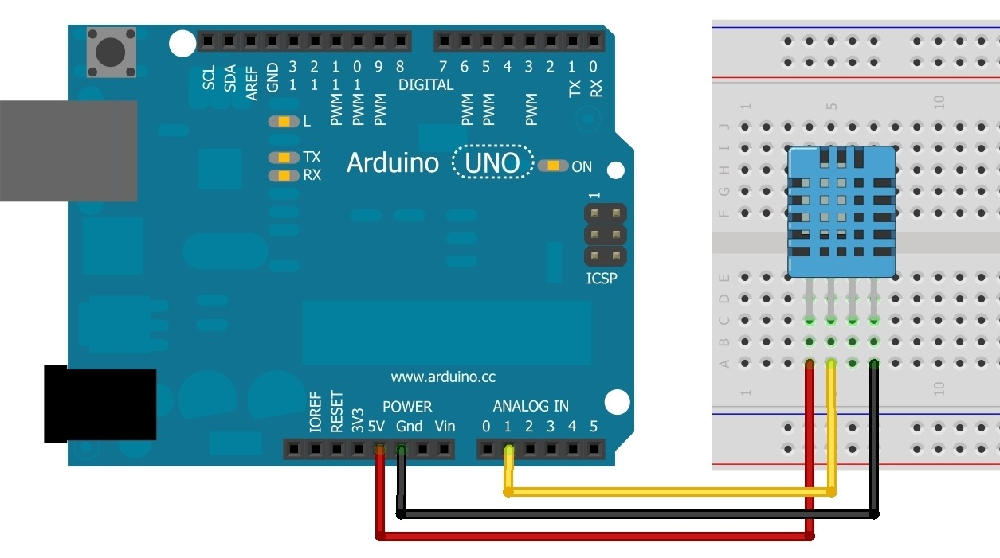
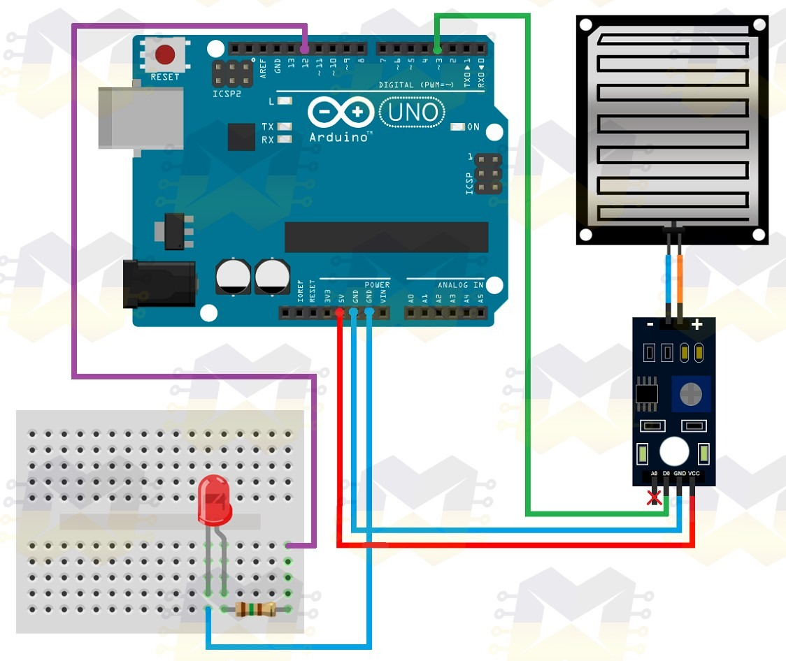

# Documentação Técnica - SMART DEHYDRATOT

## 1. Visão Geral
O **SMART DEHYDRATOT** é um sistema de monitoramento de umidade e temperatura para controle de um desidratador de alimentos. Utiliza um **Arduino** para coletar os dados dos sensores DHT-11 (temperatura/umidade) e um sensor de chuva MH-RD, transmitindo as informações para um **servidor Node.js**, que disponibiliza os dados para um **front-end web**.

## 2. Componentes Utilizados
### Hardware:
* **Arduino Uno** (ou compatível)
* **Sensor DHT-11** (Umidade e Temperatura)
* **Sensor MH-RD** (Sensor de Chuva)
* **Módulo de comunicação USB** (Para conectar ao computador)
* **Cabos jumper**

### Software:
* **Arduino IDE** (para programar o Arduino)
* **Node.js e Express.js** (para criar o servidor backend)
* **SerialPort (@serialport/stream)** (para comunicação entre Arduino e Node.js)
* **HTML, CSS e JavaScript** (para o front-end)

## 3. Funcionamento do Sistema
1. O Arduino coleta os dados do **DHT11** e do **MH-RD**.
2. Os dados são enviados pela porta serial para o **servidor Node.js**.
3. O **Node.js** recebe, processa e disponibiliza os dados em um endpoint HTTP.
4. O **front-end** acessa esse endpoint e exibe os dados ao usuário.

## 4. Circuito Estrutural

### Conexão do Sensor DHT11


### Conexão do Sensor de Chuva



## 5. Código do Arduino
O código abaixo captura os dados dos sensores e os imprime na porta serial:

```cpp
#include "DHT.h"

#define DHTPIN A1
#define DHTTYPE DHT11
const int pinoSensorChuva = 3;
DHT dht(DHTPIN, DHTTYPE);

void setup() {
  Serial.begin(9600);
  pinMode(pinoSensorChuva, INPUT);
  dht.begin();
}

void loop() {
  int estadoChuva = digitalRead(pinoSensorChuva);
  String statusChuva = (estadoChuva == LOW) ? "Chuva detectada!" : "Sem chuva.";

  float umidade = dht.readHumidity();
  float temperatura = dht.readTemperature();

  if (!isnan(umidade) && !isnan(temperatura)) {
    Serial.print("{");
    Serial.print("\"temperatura\": "); Serial.print(temperatura);
    Serial.print(", \"umidade\": "); Serial.print(umidade);
    Serial.print(", \"chuva\": \""); Serial.print(statusChuva);
    Serial.println("\"}");
  }
  delay(2000);
}
```

## 6. Servidor Node.js
Cria um servidor que recebe os dados do Arduino e os disponibiliza via HTTP.

```javascript
const express = require("express");
const { SerialPort } = require("serialport");
const { ReadlineParser } = require("@serialport/parser-readline");
const cors = require("cors");

const app = express();
app.use(cors());

const port = new SerialPort({ path: "COM3", baudRate: 9600 });
const parser = port.pipe(new ReadlineParser({ delimiter: "\n" }));

let lastData = { temperatura: 0, umidade: 0, chuva: "Desconhecido" };

parser.on("data", (data) => {
  try {
    lastData = JSON.parse(data);
  } catch (err) {
    console.error("Erro ao processar JSON:", err);
  }
});

app.get("/dados", (req, res) => {
  res.json(lastData);
});

app.listen(3000, () => console.log("Servidor rodando em http://localhost:3000"));
```

## 7. Front-end (HTML + CSS)
Exibe os dados coletados do Arduino em tempo real.

```html
<!DOCTYPE html>
<html lang="pt">
<head>
    <meta charset="UTF-8">
    <meta name="viewport" content="width=device-width, initial-scale=1.0">
    <title>Monitoramento do Desidratador</title>
    <link rel="stylesheet" href="styles.css">
</head>
<body>
    <div class="container">
        <h1>Monitoramento do Desidratador</h1>
        <p><strong>Temperatura:</strong> <span id="temp">--</span> °C</p>
        <p><strong>Umidade:</strong> <span id="umid">--</span> %</p>
        <p><strong>Chuva:</strong> <span id="chuva">--</span></p>
    </div>

    <script>
        async function atualizarDados() {
            try {
                const resposta = await fetch("http://192.168.18.1:3000/dados");
                const dados = await resposta.json();
                document.getElementById("temp").innerText = dados.temperatura;
                document.getElementById("umid").innerText = dados.umidade;
                document.getElementById("chuva").innerText = dados.chuva;
            } catch (error) {
                console.error("Erro ao obter dados:", error);
            }
        }
        setInterval(atualizarDados, 2000);
    </script>
</body>
</html>
```

## 8. Como Executar o Projeto
### 8.1 Subir o código para o Arduino
1. Abra o **Arduino IDE**.
2. Copie o código do Arduino e cole na IDE.
3. Selecione a placa correta (**Arduino Uno**) e a porta correta.
4. Clique em **Carregar**.

### 8.2 Iniciar o Servidor Node.js
1. Instale o Node.js e abra o terminal.
2. Instale os pacotes necessários:
   ```sh
   npm install express serialport @serialport/parser-readline cors
   ```
3. Inicie o servidor:
   ```sh
   node server.js
   ```

### 8.3 Acessar no Navegador
* No PC: `http://localhost:3000/dados`
* No Celular (na mesma rede Wi-Fi) **(usar antes da porta o IPV4 do host(PC)**): `http://'192.168.18.1':3000/dados`

---
**Com isso, você terá um sistema completo para monitoramento do seu desidratador!** 🚀
